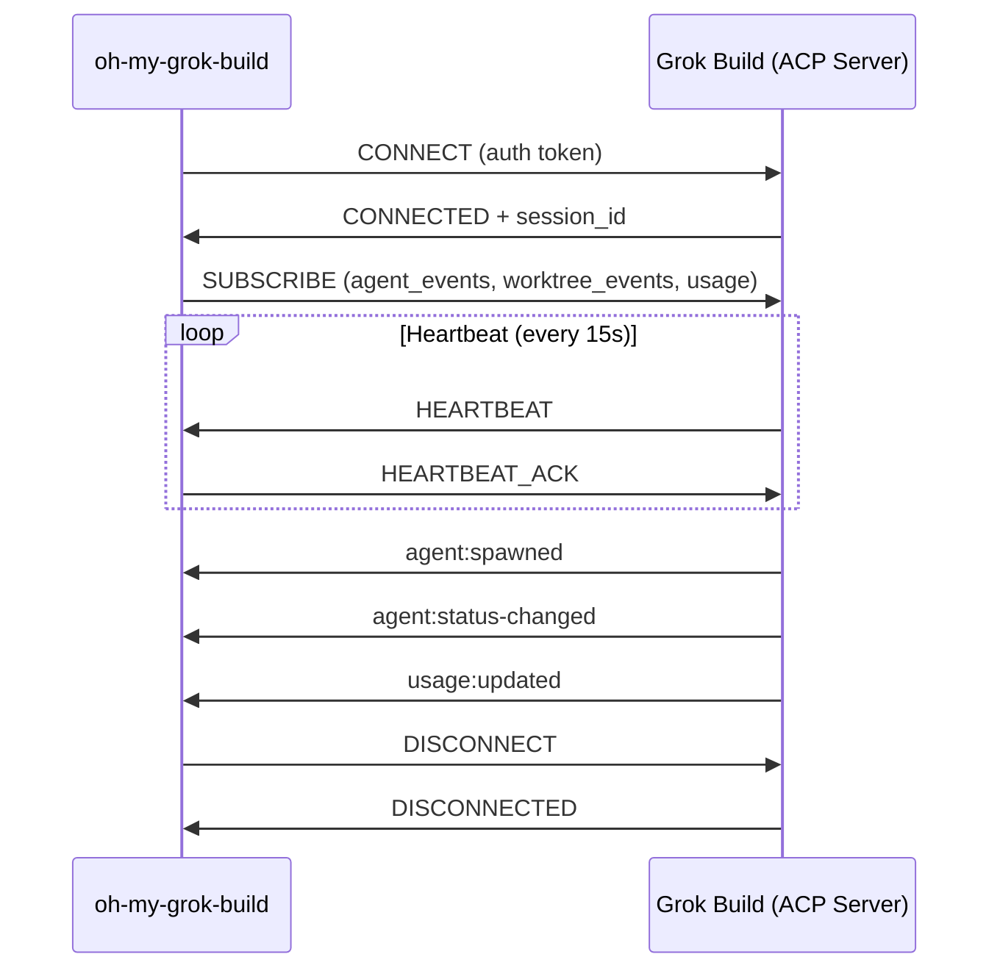

# ACP (Agent Communication Protocol) 연동 설계

**중점: stdio Transport 우선 구현**

## 1. 개요

Grok Build는 내부적으로 **ACP (Agent Communication Protocol)**을 통해 CLI와 Agent/Subagent 간의 통신을 수행합니다.

현재 `oh-my-grok-build`는 ACP와 실제로 연결되어 있지 않고, 모든 기능을 시뮬레이션 상태로 구현되어 있습니다.

이 문서는 **Grok Build의 네이티브 ACP와 연동**하기 위한 설계를 정리하며, **stdio transport를 1차 구현 목표**로 삼습니다.

## 2. 목표

- Grok Build의 실제 ACP와 양방향 통신
- Subagent의 생명주기 실시간 수신 (spawn, status change, completed, failed)
- Worktree 생성/변경 이벤트 수신
- 사용량(quota) 실시간 업데이트
- 명령어 실행 결과 수신
- 안정적인 연결 관리 (재연결, heartbeat)

## 3. 현재 상태 (v0.3)

- `Orchestrator`가 ACP 연결을 **시뮬레이션** 중
- `SubagentManager`가 내부적으로만 상태 관리
- 모든 이벤트가 하네스 내부에서 발생

## 4. 제안 아키텍처 (stdio 우선)

### 4.1 ACPClient 클래스 (stdio 중심)

```ts
class ACPClient extends EventEmitter {
  private transport: 'stdio' | 'websocket' = 'stdio';
  private childProcess?: ChildProcess;   // stdio transport용
  private ws?: WebSocket;                // websocket transport용 (미래 확장)

  async connect(): Promise<void>;
  disconnect(): void;
  send(message: ACPMessage): void;

  // 주요 이벤트
  on('agent:spawned', handler)
  on('agent:status-changed', handler)
  on('agent:completed', handler)
  on('agent:failed', handler)
  on('worktree:created', handler)
  on('usage:updated', handler)
}
```

**1차 구현 목표**: `transport: 'stdio'`로 고정하여 개발

### 4.2 stdio Transport 프로토콜 (상세)

Grok Build CLI와의 stdio 통신은 **JSON Lines (JSON + newline)** 형식을 사용합니다.

**메시지 형식**:
```json
{"id":"msg-001","type":"agent:spawned","timestamp":1747681234567,"payload":{...}}\n
```

**특징**:
- 각 메시지는 `\n`으로 구분
- 한 줄 = 하나의 완전한 JSON 메시지
- 양방향 통신 (stdin으로 보내고, stdout으로 받음)

**장점**:
- 매우 간단하고 안정적
- 디버깅이 용이 (터미널에서 직접 확인 가능)
- Grok Build CLI의 headless 모드와 잘 맞음

### 4.2.1 기본 메시지 형식

```ts
interface ACPMessage {
  id: string;                    // UUID (요청-응답 매칭용)
  type: ACPMessageType;
  timestamp: number;
  payload: any;
  error?: ACPError;
}

type ACPMessageType =
  | 'agent:spawned'
  | 'agent:status-changed'
  | 'agent:completed'
  | 'agent:failed'
  | 'worktree:created'
  | 'worktree:updated'
  | 'usage:updated'
  | 'command:result'
  | 'heartbeat'
  | 'error';
```

### 4.2.2 주요 메시지 예시

**Agent Spawned**
```json
{
  "id": "msg-uuid-123",
  "type": "agent:spawned",
  "timestamp": 1747681234567,
  "payload": {
    "id": "sub-abc123",
    "role": "executor",
    "worktree": "executor-1747681234567",
    "startedAt": 1747681234567
  }
}
```

**Agent Status Changed**
```json
{
  "id": "msg-uuid-124",
  "type": "agent:status-changed",
  "timestamp": 1747681240000,
  "payload": {
    "id": "sub-abc123",
    "status": "COMPLETED",
    "completedAt": 1747681240000,
    "result": { "success": true }
  }
}
```

**Usage Updated**
```json
{
  "id": "msg-uuid-125",
  "type": "usage:updated",
  "timestamp": 1747681250000,
  "payload": {
    "percent": 68,
    "remaining": 1240
  }
}
```

**Error Message**
```json
{
  "id": "msg-uuid-126",
  "type": "error",
  "timestamp": 1747681260000,
  "payload": {
    "code": "AGENT_SPAWN_FAILED",
    "message": "Failed to create worktree",
    "details": { "reason": "disk_full" }
  }
}
```

## 5. 구현 단계 (stdio 우선)

**Phase 4.1** — ACPClient (stdio transport) 기본 구조 구현  
**Phase 4.2** — Grok Build CLI와 stdio 연결 + JSON Lines 송수신  
**Phase 4.3** — Subagent 이벤트 수신 및 SubagentManager 연동  
**Phase 4.4** — Worktree 이벤트 + HUD 실시간 반영  
**Phase 4.5** — 에러 처리, 재연결, heartbeat 추가  
**Phase 4.6** (선택) — WebSocket transport 병행 지원

## 6. 연결 생명주기 (Lifecycle)



### 6.1 인증 (Authentication)
- 초기 연결 시 JWT 또는 API Key 전달
- Grok Build가 발급한 `session_token` 사용

### 6.2 재연결 전략
- Exponential Backoff (1s → 2s → 4s → max 30s)
- 최대 재연결 시도: 10회
- 재연결 후 이전 `session_id`로 상태 복구 시도

### 6.3 에러 코드 (예시)

| Code                        | 설명                     | 처리 방식       |
|----------------------------|--------------------------|-----------------|
| `AUTH_FAILED`              | 인증 실패                | 즉시 종료       |
| `AGENT_SPAWN_FAILED`       | Subagent 생성 실패       | 재시도 + 알림   |
| `QUOTA_EXCEEDED`           | 사용량 초과              | 사용자 알림     |
| `CONNECTION_LOST`          | 연결 끊김                | 자동 재연결     |

## 7. 기술 스택

- `ws` (WebSocket)
- `EventEmitter`
- `uuid`
- JSON 메시징

## 8. 주의사항

- Grok Build ACP 스펙이 아직 완전히 공개되지 않았을 수 있음
- 초기에는 **stdio transport**로 시작하는 것이 안정적
- 보안: 인증 토큰은 환경변수에서 로드, 민감 정보 로그 금지

---

**다음 단계**

이 설계를 바탕으로 `ACPClient`를 실제로 구현할까요?

원하시면 바로 **Phase 4.1**부터 시작하겠습니다.

### 4.3 Orchestrator와의 연동

```ts
// orchestrator.ts
async connectToACP() {
  this.acpClient = new ACPClient();
  await this.acpClient.connect();

  this.acpClient.on('agent:spawned', (agent) => {
    this.subagentManager.registerExternalAgent(agent);
  });

  this.acpClient.on('agent:status-changed', ({ id, status }) => {
    this.subagentManager.setStatus(id, status);
  });

  this.acpClient.on('usage:updated', ({ percent }) => {
    this.tmuxStatus.updateUsage(percent);
  });
}
```

## 5. 연결 생명주기 (Lifecycle)


### 5.1 인증 (Authentication)

- 초기 연결 시 **JWT 또는 API Key** 전달
- Grok Build가 발급한 `session_token` 사용
- 모든 메시지에 `Authorization: Bearer <token>` 포함 (필요 시)

### 5.2 재연결 전략 (Reconnection)

- Exponential Backoff (1s → 2s → 4s → 8s → max 30s)
- 최대 재연결 시도 횟수: 10회
- 재연결 후 이전 `session_id`로 상태 복구 시도
- 연결 끊김 감지: 30초 이상 heartbeat 미수신 시

### 5.3 에러 코드 정의 (예시)

| Code                        | 설명                              | 처리 방식          |
|----------------------------|-----------------------------------|--------------------|
| `AUTH_FAILED`              | 인증 실패                         | 즉시 종료          |
| `AGENT_SPAWN_FAILED`       | Subagent 생성 실패                | 재시도 + 알림      |
| `WORKTREE_CREATION_FAILED` | Worktree 생성 실패                | 대체 경로 사용     |
| `QUOTA_EXCEEDED`           | 사용량 초과                       | 사용자 알림        |
| `CONNECTION_LOST`          | 연결 끊김                         | 자동 재연결        |
| `INVALID_MESSAGE`          | 잘못된 메시지 형식                | 무시 + 로그        |

## 6. 기술 스택 제안

- `ws` 패키지 (WebSocket 클라이언트)
- EventEmitter (Node.js 내장)
- JSON 기반 메시지 포맷 (Grok Build ACP 스펙에 맞춤)

## 7. 주의사항

- Grok Build의 ACP 스펙이 아직 공개되지 않았을 수 있음
- 초기에는 **stdio 기반** transport로 시작하는 것이 더 안정적일 수 있음
- 보안: 인증 토큰, 서명 검증 필요 (Grok Build 정책에 따름)

---

**다음 단계**

이 설계를 바탕으로 `ACPClient`를 실제로 구현할까요?

원하시면 바로 **Phase 4.1** (ACPClient 기본 구조)부터 시작하겠습니다.